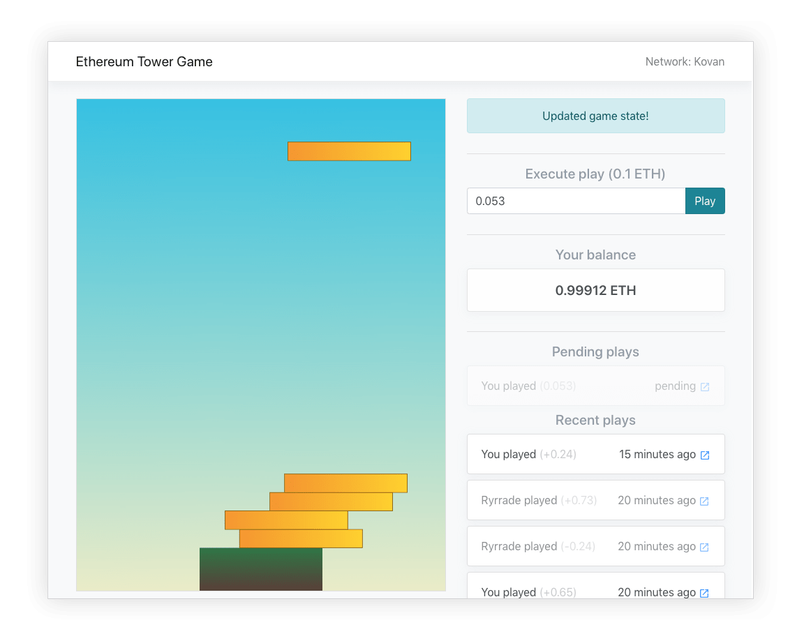

# Ethereum Tower Game

DApp game featuring a 1D statics physics solver on-chain

http://dapplion.github.io/tower-game

  

Everytime a user plays, a fixed amount is deposited in the contract. If the arrangent of coins triggers them to fall, the contract will transfer the `play price * amount of fallen coins` to the user.

The 1D static physics solver assumes constant mass and null height. In order to save gas, the statibility is checked from top to bottom, so in the case of multiple unstable levels, the least amount of coin will fall. An average play with 1-50 stacked coins requires ~50k-100k gas.
